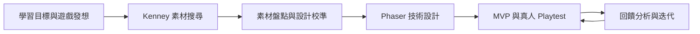

# 教育型 2D 遊戲開發工作流程

這套流程以學習目標為起點，先用教育遊戲設計卡把學習行為整合進核心玩法，再尋找支援概念的 Kenney 素材，最後使用 Phaser skills 完成技術設計、MVP、真人 Playtest 與迭代。



## 使用方式

1. 依序執行每個階段，不要一次貼上全部 Prompt。
2. 每個階段都在同一個 Codex task 與同一個 repository 中進行。
3. 第 1 階段決定 `gameSlug` 後，後續階段必須沿用，不得另建遊戲目錄。
4. 學習目標與卡組是設計主軸；素材只能調整呈現方式與 MVP 範圍，不能把遊戲改成無關的玩法。
5. `assets-source/` 保存原始素材；遊戲只複製實際使用的檔案到 `games/<gameSlug>/`。
6. 真人 Playtest 必須由使用者實際遊玩，Codex 不得自行模擬玩家表現或學習成效。

## 第 1 階段：學習目標與教育遊戲發想

目標：把學科主題轉成可觀察的學習目標，組合教育遊戲設計卡，選定可製作的核心玩法。

### Prompt

```text
請使用 Educational Game Ideation Skill，帶我把以下教育需求發想成一款可製作的 2D 遊戲：

- 學習對象：{{年齡、年級或先備能力}}
- 學科或主題：{{主題}}
- 希望學會的能力：{{可先留空，由你協助釐清}}
- 單次遊玩時間：{{時間}}
- 平台或輸入限制：{{桌面、鍵盤、滑鼠、觸控等}}
- 其他製作限制：{{可留空}}

先區分「主題」與「可觀察的學習結果」。如果目前只有主題，先提出 2–3 個合理的學習行為方向，例如比較、預測、診斷、建模、最佳化、解釋或遷移，使用自然語言說明差異，讓我選擇或修正。

學習目標明確後，從教育遊戲設計卡中提出 2–3 組真正不同的玩法方向。每組先使用一張主要學習行為卡、玩家操作卡、世界規則卡、挑戰卡、隱性評量卡與回饋卡；只有在能明顯改善設計時才加入輔助卡。

每個方向請說明：

- 一句話遊戲體驗
- 可觀察的學習目標
- 卡組與卡片編號
- 玩家每 10–30 秒反覆進行的核心循環
- 為什麼玩家必須運用目標思考，而不是靠反應、猜測或重複刷取
- 遊戲如何從玩家行為取得學習證據
- 回饋如何幫助玩家修正心智模型，而不過早給答案
- 最小 Phaser 原型需要的內容
- 主要優點、風險與製作範圍

不同方向應改變核心操作、世界規則或挑戰，不要只替同一玩法換故事背景。請檢查移除題目或測驗後，學習是否仍然存在於核心操作中；如果移除答題後留下的是無關遊戲，代表學習與玩法尚未整合，請修正。

引導我選定一個方向後，替遊戲命名並產生簡短的小寫英文 `gameSlug`，單字間使用連字號。建立 `./games/{{gameSlug}}/docs/`，將最終教育遊戲概念寫入 `./games/{{gameSlug}}/docs/learning-design.md`。

`learning-design.md` 至少包含：

- 學習對象與先備能力
- 可觀察的學習目標
- 遊戲前提與 30 秒核心循環
- 主要卡組與選擇理由
- 挑戰進程
- 隱性評量證據
- 回饋行為
- 最小可測試原型
- 尚未解決的設計決策

這個階段只負責教育遊戲發想與概念收斂。不要搜尋素材、建立 Phaser 專案或產生遊戲程式碼。
```

## 第 2 階段：依教育遊戲概念搜尋 Kenney 素材

目標：尋找能支援既定學習核心與玩家操作的素材，而不是讓素材反過來改變學習目標。

### Prompt

```text
請接續上一階段，沿用既有 `gameSlug`。先讀取 `./games/{{gameSlug}}/docs/learning-design.md`，確認學習對象、學習目標、主要卡組、核心循環、必要玩家操作、世界規則、挑戰、評量證據與回饋方式。

請使用 Kenney Assets Search Skill 與可用的網頁或瀏覽器工具，尋找能支援這個教育遊戲概念的官方 Kenney 素材包。搜尋條件應由 `learning-design.md` 的核心操作、世界表現與必要物件推導，不要只根據故事題材搜尋。

先比較候選素材包，確認官方頁面、內容、格式與目前可用狀態。選擇一個主要素材包；只有主要素材包明顯缺少必要 UI、圖示、音效或其他關鍵內容時，才加入少量互補素材包。

如果找不到完全符合的素材，優先調整視覺主題、角色造型或場景表現，不要改變已確定的學習目標、主要學習行為或核心玩法。清楚記錄素材限制可能造成的 MVP 調整，留待下一階段確認。

確認後，將官方壓縮檔下載到 `assets-source/` 並解壓縮到獨立資料夾。不要覆蓋既有檔案。解壓縮後先確認資料夾存在、內容非空且壓縮檔可正常讀取，再刪除這次已成功解壓縮的 ZIP。

不要捐款、購買、登入、使用鏡像網站或猜測下載網址。完成後回報選擇的素材包、選擇理由、支援哪些核心操作或回饋、官方連結、下載與解壓縮路徑、已知缺口及驗證結果。
```

## 第 3 階段：素材盤點與教育遊戲設計校準

目標：以實際素材校準呈現方式與 MVP 範圍，同時保護學習—玩法整合。

### Prompt

```text
請接續既有教育遊戲概念與素材，沿用 `gameSlug`。開始前讀取：

- `./games/{{gameSlug}}/docs/learning-design.md`
- `assets-source/` 中的實際素材

完整檢查 `assets-source/`，不要只根據檔名或資料夾名稱猜測。盤點角色、敵人、障礙物、操作物件、道具、場景、背景、UI、圖示、動畫、特效、音效、音樂、字型、地圖及其他可能影響玩法或學習回饋的素材，並記錄：

- 實際檔案路徑
- 檔案類型
- 圖片尺寸或媒體資訊
- 可從檔案本身可靠確認的用途或規格
- 可能支援的玩家操作、世界狀態或回饋
- README、LICENSE 與其他授權資訊

如果素材是 spritesheet、tileset、atlas 或其他需要切割的圖片，只記錄能可靠判斷的資訊。無法確認的 frameWidth、frameHeight、動畫順序、用途或其他規格標記為「待確認」，不要猜測。

將盤點結果寫入 `./games/{{gameSlug}}/docs/asset-inventory.md`。

接著比對 `learning-design.md` 與實際素材。素材是檔案與規格的最終事實來源；`learning-design.md` 是學習目標與玩法關係的設計來源。允許依素材調整視覺題材、物件造型、敵人數量、動畫豐富度與 MVP 範圍，但不要把學習行為替換成無關玩法，也不要把核心學習降級成遊戲外掛答題。

完成校準後建立 `./games/{{gameSlug}}/docs/game-design.md`，內容包括：

- 一句話核心玩法
- 學習目標如何存在於玩家反覆操作中
- 玩家目標、勝利與失敗條件
- 操作方式與主要能力
- 世界規則、挑戰與難度進程
- 敵人、障礙、道具與場景元素的玩法差異
- 每 10–30 秒的核心循環
- 即時遊戲回饋與學習回饋
- 可觀察的隱性評量事件與資料
- 第一版 MVP 與後續擴充

重新檢查：

- 玩家是否必須使用目標思考才能成功
- 成功是否可能只靠反應、猜測或刷取
- 評量證據是否對應學習目標，而不只是完成與分數
- 回饋是否揭示因果、策略或錯誤模式，而不過早給答案
- 玩家能否在 30 秒內理解玩法
- MVP 是否足夠小且可測試一個完整學習循環

如果 `learning-design.md`、`game-design.md` 與實際素材不一致，以素材修正檔案規格與呈現方式，但保留已確認的學習核心；無法兼顧時停止並向使用者說明具體衝突，不自行改變目標。

這個階段只負責素材盤點與遊戲設計校準，不要建立遊戲程式或產生完整程式碼。
```

## 第 4 階段：Phaser 技術實作方案

目標：將教育遊戲設計轉換成可直接開發、可觀察學習行為的 Phaser 技術方案。

### Prompt

```text
請接續既有教育遊戲規劃，沿用 `gameSlug`，使用符合需求的 Phaser skills 建立技術實作方案。開始前讀取：

- `./games/{{gameSlug}}/docs/learning-design.md`
- `./games/{{gameSlug}}/docs/asset-inventory.md`
- `./games/{{gameSlug}}/docs/game-design.md`
- `assets-source/` 中的實際素材

實際素材是檔案規格的最終事實來源；`learning-design.md` 與 `game-design.md` 是學習目標與核心玩法的設計來源。可以做必要的小幅技術調整，但不要捏造素材、把學習改成外掛答題，或為了實作方便改變核心玩法。

規劃內容包括：

1. 必要 Scene、各自責任、切換方式與跨 Scene 資料。
2. 實際使用素材的原始路徑、遊戲目標路徑、asset key、載入方式、使用位置與 Game Object 類型。
3. 可可靠確認的 spritesheet、tileset、atlas frame 與動畫資訊；不確定者標記「待確認」。
4. 玩家、操作物件、敵人、障礙、道具、場景、提示與 UI 對應的 Phaser 結構。
5. 必要的 Physics、輸入、碰撞、狀態、計時器、事件與 callback。
6. `preload()`、`create()`、`update()`、Timer Event、Physics callback、EventEmitter 與 Scene events 的責任分配。
7. 分數、生命、遊戲進度與 gameState，以及學習證據資料應保存的位置。
8. 簡單、可維護且不過度工程化的專案結構。

除了遊戲狀態，也要把 `learning-design.md` 中的隱性評量與回饋轉換成可實作事件。例如可依實際設計記錄：

- 首次策略或首次選擇
- 錯誤模式
- 重試與修正路徑
- 使用步驟或資源效率
- 提示使用時機
- 新情境中的遷移表現

只記錄與學習目標有關、能在 MVP 中合理解釋的資料；不要加入大型分析系統、伺服器或不必要的追蹤。規劃回饋何時出現、呈現哪些因果或策略資訊，以及如何避免直接洩漏答案。

`assets-source/` 必須保留原始素材。只規劃把正式遊戲需要的檔案複製到 `./games/{{gameSlug}}/` 的 assets 目錄。

依相依關係將 MVP 拆成可逐步完成並驗證的小任務，從專案啟動、素材載入、核心操作、世界規則、挑戰、成功失敗、評量事件、學習回饋、Restart、基本 UI 與必要音效依序完成。

每一階段說明目標、主要檔案、功能、完成條件與最簡單可靠的驗證方式。MVP Done Criteria 除了可完整遊玩，也必須能觀察至少一項與學習目標直接相關的玩家決策或修正，並提供對應回饋。

將方案寫入 `./games/{{gameSlug}}/docs/technical-design.md`。內容需足以讓下一階段直接實作，不必重新設計核心玩法、學習評量或開發順序。

這個階段不要一次產生完整遊戲，也不要新增設計文件沒有的大型功能。
```

## 第 5 階段：MVP 與真人學習 Playtest

目標：完成可玩的教育遊戲 Vertical Slice，觀察玩家理解、決策、修正與遊戲體驗。

### Prompt

```text
請依照 `technical-design.md` 實作教育遊戲的 Phaser MVP。開始前，閱讀 `learning-design.md`、`game-design.md`、`technical-design.md`、`asset-inventory.md`，確認學習目標、卡組、核心循環、素材、Scene、Game Object、Physics、Input、評量事件與回饋設計。

目標不是正式版，而是能讓真人實際遊玩的 Vertical Slice。維持 Spec Driven Development、Vertical Slice 與 Selective TDD：

- 依 MVP 順序逐步實作，每完成可獨立驗證的小段落就執行相關測試並啟動遊戲確認。
- scoring、health、damage、spawn rules、cooldown、progression、state transition、difficulty calculation 與可獨立判定的評量事件可使用自動測試。
- 操作手感、動畫、碰撞感受、視覺配置、提示理解與學習回饋以實際遊玩驗證為主。
- 若技術文件與實際情況不符，可做必要的小幅調整並同步更新文件，但不要重新設計學習目標或核心玩法。

MVP 至少要能正常啟動、完成核心學習操作與 gameplay loop、進入成功或失敗狀態、顯示必要遊戲與學習回饋並重新開始。完成後執行整合驗證，確認核心流程正常且 Console 沒有阻礙遊戲的 error。

確認可玩後建立 `playtest.md`。除了遊戲可用性，也要定義這次真人測試真正需要了解的學習問題，例如：

- 玩家是否理解目標、操作與成功失敗條件
- 玩家是否自然使用目標學習行為
- 成功是否可能只靠反應、猜測或反覆嘗試
- 玩家採取什麼首次策略，失敗後如何修正
- 回饋是否幫助玩家看見因果、錯誤模式或策略差異
- 提示是否過早給答案或造成依賴
- 玩家能否把規則用到稍有變化的新情境
- 難度與認知負荷是否合理
- 核心玩法是否讓玩家願意再玩一次

完成 `playtest.md` 後，不要自行模擬真人 Playtest、學習表現或玩家回饋。告訴使用者遊戲已可測試，先請使用者實際玩一小段，再以自然對話詢問一個或少數幾個最重要問題。根據回答追問具體情境，不要用教育術語考問玩家，也不要暗示預設答案。

持續互動到重要觀察項目取得足夠資訊。無法確認者保留為未驗證。清楚區分：

- 使用者實際描述的行為、想法與感受
- 遊戲記錄或描述可直接確認的現象
- 對學習理解或問題原因的合理推論

不要僅憑完成關卡或高分宣稱玩家已經學會，也不要把推論寫成使用者親口說過的內容。

完成後建立 `playtest-feedback.md`，整理測試版本、範圍、玩家觀察、首次策略、錯誤與修正歷程、操作與 UX、Gameplay、學習回饋、Bug、難度與認知負荷、玩家建議、合理推論及未驗證項目。保留具體發生情境。

完成後不要立即修改遊戲。告訴使用者真人 Playtest 與回饋整理已完成，等待第 6 階段 Prompt。
```

## 第 6 階段：學習與遊戲回饋迭代

目標：以真人證據排序問題，完成一輪聚焦修改，更新下一次 Playtest 重點。

### Prompt

```text
請根據真人 Playtest 結果迭代目前的教育遊戲 MVP。開始前，閱讀 `learning-design.md`、`game-design.md`、`technical-design.md`、`playtest.md`、`playtest-feedback.md`、目前程式碼與既有測試。

如果 `playtest-feedback.md` 不存在、為空或沒有真人 Playtest 結果，停止並告訴使用者缺少實際測試資料；不要模擬玩家表現、學習成效或回饋，也不要修改遊戲。

先建立 `playtest-findings.md`，將現象整理成可供開發判斷的 Findings，可依下列類型分類：

- Bug 與核心流程
- 操作與 UX
- 遊戲規則理解
- 學習—玩法整合
- 評量證據有效性
- 學習回饋與提示
- 難度、數值與認知負荷
- 核心 Gameplay
- 視覺與音效
- 新功能建議
- 目前 MVP 不處理的項目

每個 Finding 記錄 Playtest Evidence、發生情境、是否可重現、可能原因、影響、建議方向與優先級：P0 核心流程中斷；P1 明顯影響核心玩法、玩家理解或學習目標；P2 降低體驗或證據品質；P3 低影響或新想法。

不要把單次成功、完成關卡或高分直接解讀為精熟。先判斷證據能否支持結論，並把已確認事實與推論分開。

接著建立 `iteration-plan.md`。優先處理 P0，以及直接破壞核心學習循環的 P1，例如玩家不需要目標思考就能成功、回饋無法幫助修正、評量只測到操作速度，或玩家完全誤解規則。低成本且能明顯改善理解或證據品質的項目也可優先。

不要一輪解決全部回饋，不因單一玩家的功能建議擴張 MVP，也不要用增加測驗題目掩蓋學習—玩法整合問題。計畫需記錄本輪範圍、理由、預期改善、實作順序與延後項目。

完成計畫後才修改程式碼。一次處理一個 Finding，維持 Spec Driven Development、Vertical Slice 與 Selective TDD。每項修改後先執行相關測試，再實際啟動遊戲驗證改善與回歸。

完成後執行 Regression Check，確認遊戲可啟動、可操作，核心循環、Collision、Score、Health、Game Over、Restart、評量事件與學習回饋正常，Console 沒有新增會影響遊戲的 error。

建立 `iteration-report.md`，記錄處理的 Findings、原始 Evidence、修改內容、原因、驗證結果、延後項目、新發現問題及下一次 Playtest 重點。更新 `playtest.md`，讓下一輪測試觀察修改是否真正改善玩家決策、理解與修正，而不只是確認新功能存在。

完成後停止增加功能，告訴使用者本輪 Iteration 已完成，接著再次進入第 5 階段的真人學習 Playtest。之後持續重複 Playtest、整理證據、分析、排優先級、修改與驗證。
```
