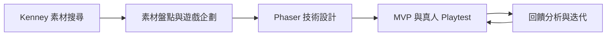

# 一般 2D 遊戲開發工作流程

這套流程適合從 Kenney 素材出發，逐步完成遊戲企劃、Phaser 技術設計、可玩 MVP、真人 Playtest 與迭代。



## 使用方式

1. 依序執行每個階段，不要一次貼上全部 Prompt。
2. 每個階段都在同一個 Codex task 與同一個 repository 中進行。
3. 第 2 階段決定 `gameSlug` 後，後續階段必須沿用，不得另建遊戲目錄。
4. `assets-source/` 保存原始素材；遊戲只複製實際使用的檔案到 `games/<gameSlug>/`。
5. 真人 Playtest 必須由使用者實際遊玩，Codex 不得自行模擬玩家回饋。

## 第 1 階段：搜尋並準備 Kenney 素材

目標：找到適合題材的官方素材包，建立後續企劃與開發可直接檢查的原始素材庫。

### Prompt

```text
請使用 Kenney Assets Search Skill 與可用的網頁或瀏覽器工具，替我尋找最適合「{{遊戲題材}}」的 Kenney 素材包。

先比較候選素材包，確認官方頁面、內容、格式與目前可用狀態，再選擇一個主要素材包；只有在主要素材包明顯缺少必要的 UI、音效或其他關鍵內容時，才加入少量互補素材包。

確認後，將官方壓縮檔下載到 `assets-source/` 並解壓縮到獨立資料夾。不要覆蓋既有檔案。解壓縮後先確認資料夾存在、內容非空且壓縮檔可正常讀取，再刪除這次已成功解壓縮的 ZIP。

不要捐款、購買、登入、使用鏡像網站或猜測下載網址。完成後回報選擇的素材包、官方連結、下載與解壓縮路徑，以及驗證結果。
```

## 第 2 階段：素材盤點與遊戲企劃

目標：以實際素材為依據，決定核心玩法與 MVP，建立素材清單與遊戲設計文件。

### Prompt

```text
請接續剛才取得的素材，根據目前 `assets-source/` 中實際存在的內容，規劃一款規模適中、不需要伺服器端功能、核心玩法清楚、容易製作且具有可玩性的 2D 遊戲。

開始規劃前，完整檢查 `assets-source/`，不要只根據檔名或資料夾名稱猜測內容。盤點角色、敵人、Boss、障礙物、武器、投射物、道具、場景、背景、UI、動畫、特效、音效、音樂、字型、地圖及其他可能影響玩法的素材，並記錄：

- 實際檔案路徑
- 檔案類型
- 圖片尺寸或媒體資訊
- 可從檔案本身可靠確認的用途或規格
- README、LICENSE 與其他授權資訊

如果素材是 spritesheet、tileset、atlas 或其他需要切割的圖片，只記錄能可靠判斷的排列資訊。無法從現有素材確認的 frameWidth、frameHeight、動畫順序、角色用途或其他規格，標記為「待確認」，不要猜測。

替遊戲取名並產生簡短的小寫英文 `gameSlug`，單字間使用連字號。建立 `./games/{{gameSlug}}/docs/`，將盤點結果寫入 `./games/{{gameSlug}}/docs/asset-inventory.md`。

完成盤點後，比較素材可支援的玩法，選擇最好理解、最容易完成、程式複雜度合理且最有可玩性的方案。定義：

- 一句話核心玩法
- 玩家反覆進行的主要行動
- 玩家目標、勝利與失敗條件
- 操作方式與主要能力
- 敵人、障礙物、道具與場景元素的玩法差異
- 計分或進度方式
- 每 10–30 秒的核心遊戲循環
- 玩家回饋、難度提升與持續決策

優先利用現有素材，不要為了增加功能而大量假設不存在的角色、動畫、物件或介面。不同敵人、道具與重要物件應產生真正的玩法差異，而不只是換外觀。

接著定義第一版 MVP，只保留核心玩法成立所需內容，例如玩家控制、主要互動或攻擊、少量敵人或障礙、主要目標、碰撞或互動、生命或失敗機制、基本計分或進度、勝負條件與重新開始。

除非核心玩法確實需要，不要在 MVP 加入商店、技能樹、大量關卡、多種貨幣、複雜劇情、成就、多玩家或大型存檔系統。Boss、新武器、新場景、進階 UI 與額外內容可列為後續擴充。

完成後重新檢查：玩家能否在 30 秒內理解玩法、核心循環是否清楚、MVP 是否足夠小、每個機制是否帶來新決策，以及是否有可刪除而不影響核心樂趣的功能。

將最終規劃寫入 `./games/{{gameSlug}}/docs/game-design.md`。後續工作沿用同一個 `gameSlug`。如果文件與實際素材不一致，以 `assets-source/` 的實際檔案為準並同步修正文檔。

這個階段只負責素材盤點與遊戲設計，不要建立遊戲程式或產生完整程式碼。
```

## 第 3 階段：Phaser 技術實作方案

目標：把遊戲設計轉換成可直接開發的 Phaser 技術方案與 MVP 任務順序。

### Prompt

```text
請接續剛才完成的遊戲規劃，使用 Phaser 製作這款遊戲。沿用上一階段決定的 `gameSlug`，不要重新命名或建立新的遊戲目錄。

開始前，讀取：

- `./games/{{gameSlug}}/docs/asset-inventory.md`
- `./games/{{gameSlug}}/docs/game-design.md`
- `assets-source/` 中的實際素材

實際素材是最終事實來源。如果文件與素材不同，以素材為準；可以調整技術方案，但不要擅自改變已確定的核心玩法，也不要捏造素材、動畫或功能。

請使用符合需求的 Phaser skills，將企劃轉換成可直接開發的技術方案，包括：

1. 必要的 Scene、各自責任、切換方式與跨 Scene 資料。
2. 實際會使用的素材、原始路徑、遊戲目標路徑、asset key、載入方式、使用位置與 Game Object 類型。
3. spritesheet、tileset 或 atlas 可確認的 frame、切割與動畫資訊；不確定者標記「待確認」。
4. 玩家、敵人、Boss、障礙、武器、投射物、道具、場景與 UI 對應的 Sprite、Image、Container、Group、Physics Group、Static Group、Particle、Text 或其他結構。
5. 必要的 Physics、速度、加速度、重力、collision、overlap、碰撞範圍、生命、傷害、無敵時間、冷卻與其他狀態。
6. 真正需要的 Keyboard、Mouse、Pointer 或 Touch 輸入，以及與 Phaser Input API 的對應。
7. 遊戲開始、主要操作、敵人生成、碰撞、傷害、死亡、得分、勝利、Game Over 與 Restart 等狀態與事件。
8. `preload()`、`create()`、`update()`、Timer Event、Physics callback、EventEmitter 與 Scene events 的責任分配，避免把全部邏輯塞進 `update()`。
9. 分數、生命、進度、wave、時間、敵人數量與 gameState 應放在 Scene property、Game Object、Registry、config 或獨立資料模組中的位置。
10. `./games/{{gameSlug}}/` 的簡單專案目錄與檔案結構，避免過度工程化。

`assets-source/` 必須保留原始素材。只規劃把正式遊戲需要的檔案複製到 `./games/{{gameSlug}}/` 的 assets 目錄，不修改或覆蓋原始素材。

依功能相依關係把 MVP 拆成可逐步完成並驗證的小任務。從建立專案並顯示畫面開始，再依序完成素材載入、主要 Scene、玩家、輸入、核心操作、Physics、碰撞、敵人或障礙、傷害與失敗、計分或進度、勝負、Restart、基本 UI 與必要音效。

每一階段說明實作目標、主要檔案、功能、完成條件與最簡單可靠的驗證方式。最後依 `game-design.md` 定義明確的 MVP Done Criteria。

將完整方案寫入 `./games/{{gameSlug}}/docs/technical-design.md`。內容需足以讓下一階段直接實作，不必重新設計核心玩法、技術架構或開發順序。

這個階段不要一次產生完整遊戲，也不要新增 `game-design.md` 沒有的大型功能。
```

## 第 4 階段：MVP 與真人 Playtest

目標：完成可玩的 Vertical Slice，透過自然對話引導真人 Playtest，整理實際回饋。

### Prompt

```text
請依照 `technical-design.md` 實作 Phaser MVP。開始前，先閱讀 `game-design.md`、`technical-design.md`、`asset-inventory.md`，確認遊戲目標、素材、核心玩法、Scene、Game Object、Physics、Input、狀態與事件設計。

目標不是正式版，而是能讓真人實際遊玩的 Vertical Slice。維持 Spec Driven Development、Vertical Slice 與 Selective TDD：

- 依 MVP 順序逐步實作，每完成可獨立驗證的小段落就執行相關測試並啟動遊戲確認。
- scoring、health、damage、spawn rules、cooldown、progression、state transition、difficulty calculation 等純邏輯可使用自動測試。
- 操作手感、動畫、碰撞感受、視覺效果與配置以實際遊玩驗證為主，不為測試覆蓋率建立不必要的抽象。
- 若 `technical-design.md` 與實際情況不符，可做必要的小幅調整；明顯影響技術設計時同步更新文件，不重新設計核心玩法。

MVP 至少要能正常啟動、完成核心操作與 gameplay loop、進入成功或失敗狀態、顯示必要狀態並重新開始。完成後執行完整整合驗證，確認核心流程正常且 Console 沒有阻礙遊戲的 error。

確認可玩後，建立 `playtest.md`。它要定義真人 Playtest 需要了解的問題，例如：

- 玩家是否知道目標與操作
- 是否理解成功與失敗條件
- 是否能感受到行動結果
- 是否出現困惑
- 難度是否合理
- 核心玩法是否讓玩家想再玩一次

完成 `playtest.md` 後，不要自行模擬真人 Playtest，也不要直接結束。告訴使用者遊戲已可測試，請使用者實際玩一小段，再以自然對話一次詢問一個或少數幾個最重要的問題。根據回答追問具體情境，不要機械式逐題詢問或引導使用者接受預設答案。

持續互動到重要觀察項目取得足夠資訊。無法確認的項目保留為未驗證。清楚區分：

- 使用者實際描述的行為與感受
- 從描述可直接確認的問題
- 根據資訊做出的合理推論

完成後建立 `playtest-feedback.md`，整理測試版本、測試範圍、玩家觀察、困惑、操作與 UX、Gameplay、Bug、難度與平衡、玩家建議、合理推論及未驗證項目。保留具體發生情境，不只寫抽象結論。

完成後不要立即修改遊戲。告訴使用者 Playtest 與回饋整理已完成，等待第 5 階段 Prompt。
```

## 第 5 階段：回饋分析與下一輪迭代

目標：根據真人回饋整理 Findings、決定優先級、完成一輪修改並回到真人 Playtest。

### Prompt

```text
請根據真人 Playtest 結果迭代目前的 Phaser MVP。開始前，閱讀 `game-design.md`、`technical-design.md`、`playtest.md`、`playtest-feedback.md`、目前程式碼與既有測試。

如果 `playtest-feedback.md` 不存在、為空或沒有真人 Playtest 結果，停止並告訴使用者缺少實際測試資料；不要模擬玩家回饋或修改遊戲。

先建立 `playtest-findings.md`，將現象整理成可供開發判斷的 Findings，可依 Bug、操作與 UX、規則理解、難度與平衡、核心 Gameplay、視覺與音效、新功能建議及目前 MVP 不需處理的項目分類。

每個 Finding 記錄：

- Playtest Evidence 與發生情境
- 是否可重現
- 可能原因
- 對體驗的影響
- 建議處理方向
- 優先級：P0 核心中斷、P1 影響核心體驗、P2 降低品質、P3 低影響或新想法

接著建立 `iteration-plan.md`。優先處理 P0 與直接影響核心循環的 P1；低成本且能明顯改善理解或體驗的項目也可優先。不要一輪解決全部回饋，也不要因單一玩家的功能建議擴張 MVP。

計畫需記錄本輪處理範圍、選擇理由、預期改善、實作順序與明確延後項目。完成計畫後才修改程式碼。

一次處理一個 Finding，維持 Spec Driven Development、Vertical Slice 與 Selective TDD。每項修改後先執行相關測試，再實際啟動遊戲驗證改善與回歸。純邏輯補上或更新自動測試；手感、畫面、動畫、節奏與視覺回饋以實際遊戲驗證為主。

完成後進行 Regression Check，確認遊戲可啟動、可操作，核心循環、Collision、Score、Health、Game Over、Restart 等流程正常，Console 沒有新增會影響遊戲的 error。

建立 `iteration-report.md`，記錄處理的 Findings、原始 Evidence、修改內容、原因、驗證結果、延後項目、新發現問題及下一次 Playtest 重點。更新 `playtest.md`，讓下一輪測試驗證修改是否真正改善玩家行為與理解，而不只是確認功能存在。

完成後停止增加功能，告訴使用者本輪 Iteration 已完成，接著再次進入第 4 階段的 Guided Playtest。之後持續重複 Playtest、整理回饋、分析、排優先級、修改與驗證。
```
